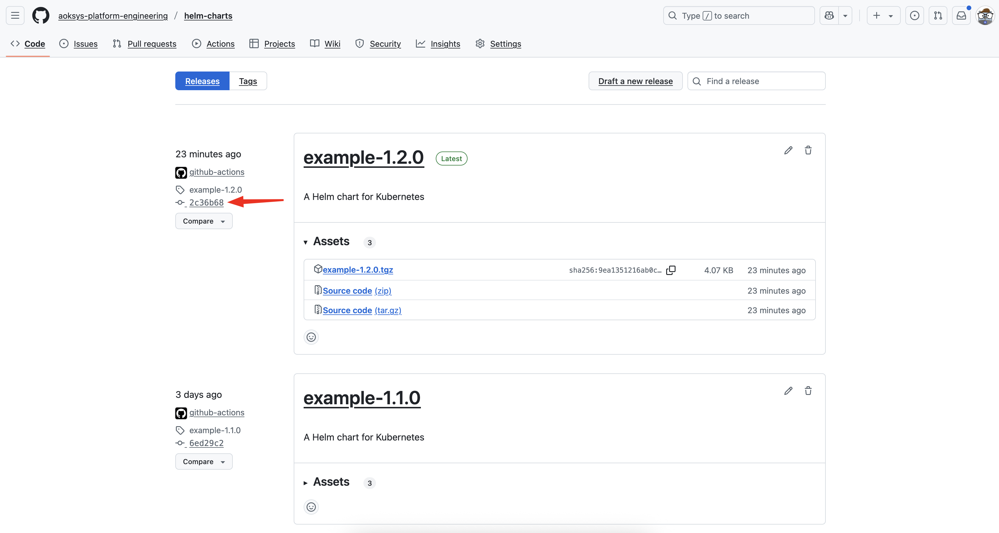
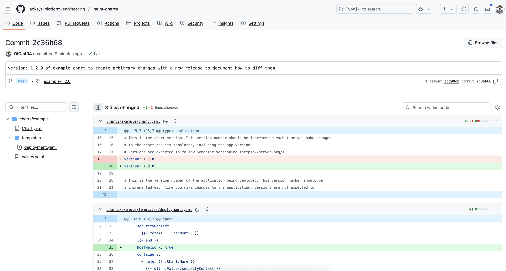

# Purpose
Helm repository hosting library and application charts developed at AOK Systems GmbH.

# Usage
[Helm](https://helm.sh) must be installed to use the charts.  Please refer to
Helm's [documentation](https://helm.sh/docs) to get started.

Once Helm has been set up correctly, add the repo as follows:

```bash
helm repo add aoksys-pe https://aoksys-platform-engineering.github.io/helm-charts
```

# Docs
Each chart includes a ``README.md`` file that provides usage instructions, configurable values, and other relevant documentation.
Additionally, every chart contains a ``changelog.md`` file that outlines all changes introduced in each released version.

You can view the ``README.md`` and ``changelog.md`` file for each chart by visiting the [charts/ folder on GitHub](https://github.com/aoksys-platform-engineering/helm-charts/tree/main/charts)
or by downloading and unpacking the chart locally after you have added the aoksys-pe helm repo as described above.

```bash
helm pull aoksys-pe/<CHART_NAME> --version <VERSION> --untar
```

# Diff release versions
In the ``Releases`` tab of the repository, you can track what has changed since the last released version of a Helm chart.

To see those changes, click on the ``Releases`` tab:


Then click on the commit for a specific release:



And finally, view the diffs for that release:



# Contributing and support
The Helm charts published in this repository are open source, but closed commit.
Development and releases are handled internally by AOK Systems GmbH.

If you are a customer and encounter issues using one of these charts, please open a support ticket via the established SUD process.
